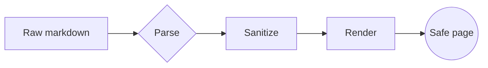

# The Markdown Viewer

A calm, **safe** reading surface for `.md` files — with math, code, diagrams,
and everything GitHub-Flavored Markdown can throw at it. Nothing in this
document can execute: it is parsed, then *scrubbed* before it ever reaches the
page.

> "Make it sexy, yet simple af." — the brief, paraphrased.

## Typography & inline elements

You get **bold**, *italic*, ~~strikethrough~~, `inline code`, ==highlight==,
super^script^ and sub~script~, plus inserted ++text++ and a footnote.[^note]
Smart typography turns "quotes" into curly ones and -- dashes -- into en/em
dashes. Auto-linking catches bare URLs like https://example.com too.

Abbreviations get a dotted underline: the HTML spec is long.

*[HTML]: HyperText Markup Language

## Scientific formulas

Inline math such as $E = mc^2$ and $\nabla \cdot \mathbf{B} = 0$ flows with the
text. Display math is centered and scrollable:

$$
i\hbar \frac{\partial}{\partial t}\,\Psi(\mathbf{r}, t)
= \left[ -\frac{\hbar^2}{2m}\nabla^2 + V(\mathbf{r}, t) \right]\Psi(\mathbf{r}, t)
$$

Chemistry works via `mhchem`:

$$
\ce{2 H2 + O2 -> 2 H2O}
$$

## Code, highlighted

```python
def fib(n: int) -> int:
    """Classic, with memoization."""
    a, b = 0, 1
    for _ in range(n):
        a, b = b, a + b
    return a
```

```javascript
const greet = (name) => `Hello, ${name}!`;
console.log(greet("world"));
```

```bash
# hover a block to reveal the copy button
rg --files | xargs wc -l | sort -n
```

## Diagrams



## Tables

| Feature        | Library      | License        |
| -------------- | ------------ | -------------- |
| Parsing        | markdown-it  | MIT            |
| Sanitizing     | DOMPurify    | Apache-2.0     |
| Math           | KaTeX        | MIT            |
| Highlighting   | highlight.js | BSD-3-Clause   |
| Diagrams       | Mermaid      | MIT            |

## Task lists

- [x] Per-site opt-in
- [x] Light & dark themes
- [x] Sanitized rendering
- [ ] Your feedback

## Definition lists

CommonMark
: The baseline specification for Markdown.

GFM
: GitHub-Flavored Markdown — tables, task lists, strikethrough, autolinks.

## Safety, demonstrated

The hostile snippets below are rendered completely inert — no script runs, no
handler fires, the `javascript:` link is downgraded to plain text:

    <script>alert('xss')</script>
    
    [a poisoned link](javascript:alert('xss'))

And the same snippets, live in the prose, are neutralized too:
<script>alert('xss')</script>

[a poisoned link](javascript:alert('xss'))

---

That's the tour. Toggle the theme and width in the top bar, and watch the
contents rail track your position as you scroll.

[^note]: Footnotes render at the bottom and link both ways.
